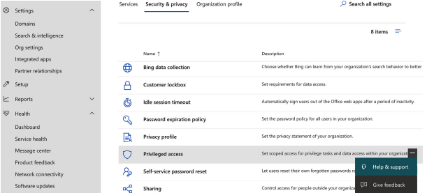
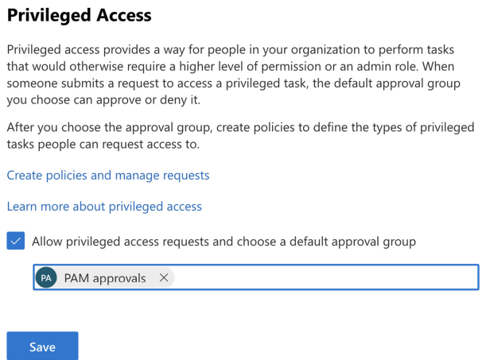
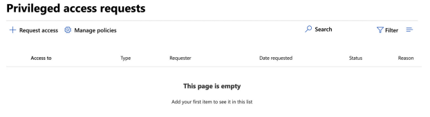
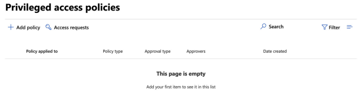
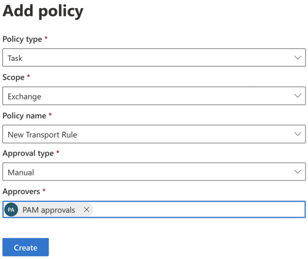
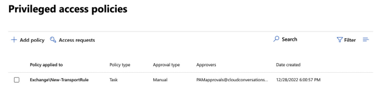
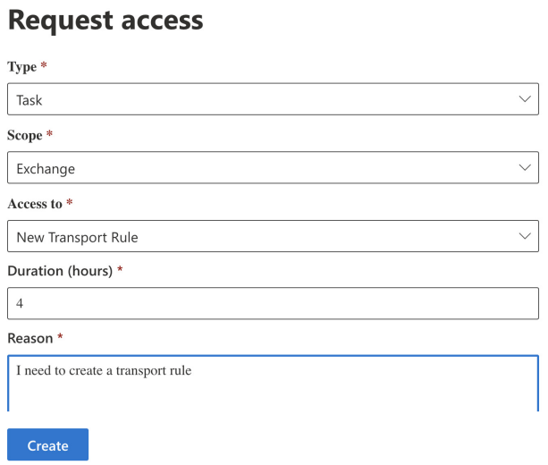

# Privileged-Access-Management-in-Microsoft-Purview
We will show you how to provide users with just enough access to elevated tasks, roles, and role groups using Privileged Access Management (PAM).


<h2>Description</h2>
<p>Microsoft Purview Privileged Access Management allows granular access control over privileged admin tasks in Office 365. It can help protect your organization from breaches that use existing privileged admin accounts with standing access to sensitive data or access to critical configuration settings.</p> <br />
<p>Privileged access management requires users to request just-in-time access to complete elevated and privileged tasks through a highly scoped and time-bounded approval workflow. This configuration gives users just-enough-access to perform the task at hand, without risking exposure of sensitive data or critical configuration settings.</p>
<p>Privileged access management complements other data and access feature protections within the Microsoft 365 security architecture.</p>
<p>As shown in the diagram, privileged access management builds on the protection provided with native encryption of Microsoft 365 data and the role-based access control security model of Microsoft 365 services. When used with Microsoft Entra Privileged Identity Management, these two features provide access control with just-in-time access at different scopes.</p>
<p align="center">
 <br />

<p>Privileged access management is defined and scoped at the task level, while Microsoft Entra Privileged Identity Management applies protection at the role level with the ability to execute multiple tasks.</p>
<p><b>Enabling privileged access management while already using Microsoft Entra Privileged Identity Management:</b> Adding privileged access management provides another granular layer of protection and audit capabilities for privileged access to Microsoft 365 data.</p>
<p><b>Enabling Microsoft Entra Privileged Identity Management while already using Microsoft Purview Privileged Access Management:</b> Adding Microsoft Entra Privileged Identity Management to Microsoft Purview Privileged Access Management can extend privileged access to data outside of Microsoft 365 that's primarily defined by user roles or identity.</p>

<h2>Licences Required:</h2>
<p>1. Microsoft 365 E5</p>
<p>2. Microsoft 365 E3 and the Microsoft 365 E5 Compliance add-on</p>
<p>3. Office 365 E3, Enterprise Mobility and Security E3, and the Microsoft 365 E5 Compliance add-on</p>
<p>4. Office 365 Enterprise E5</p>

<h2>Objective:</h2>
<p>You will need the Exchange Role Management role assigned in order to manage privileged access in Microsoft 365.</p>

<h2>Steps:</h2>
<p>1. Login to Microsoft 365 Admin Center</p>
<p>2. Settings -> org settings -> security & privacy -> privilged access</p>
<p>3. Allow privileged access requests and choose a default approval group. The group you choose must be a <b>mail-enabled security group</b>. </p>
<p>4. we will direct to Privileged access requests page. and you must first create a policy.</p>
<p>5. Manage Policies  -> + Add Policy</p>
<p>6. Fill the required details, we will select <b>Approval Type</b> as <b>Manual</b> and create </p>
<p>7. Policy created and now can be seen in the list of policies</p>
<p>8. Users can request access from the Request access page</p>
<p>9. When the user access request is created, the approver group will be notified via email.</p>
<p>10. approver must return to the Request access page and select the request, Once the request is open, the approver can then either approve or deny the request.</p>
<p>11. The requestor is then notified by email that their request has been approved or denied.</p>

<h3>Screenshots:</h3>
<p align="center">
Security & Privacy: <br/>

<br />
<p align="center">
Allowing privileged access requests:  <br/>

<br />
<p align="center">
Managing policies:  <br/>

<br />
<p align="center">
Add policy:  <br/>

<br />
<p align="center">
Adding a policy details:  <br/>

<br />
<p align="center">
New policy created: <br/>

<br />
<p align="center">
Request access:  <br/>

<br />
<p align="center">
Email requesting access notification to approver:  <br/>

<br />
<p align="center">
New task in Privileged access request:  <br/>

<br />
<p align="center">
Approving or denying the request:  <br/>

<br />
<p align="center">
Requestor notified of approval:  <br/>

<br />
<br />

<h2>Conclusion:</h2>
<p>PAM is an excellent way to reduce risk and provide your users with only the access they need on demand, rather than permanently granting access to powerful privileged roles.</p>


<!--
 ```diff
- text in red
+ text in green
! text in orange
# text in gray
@@ text in purple (and bold)@@
```
--!>
